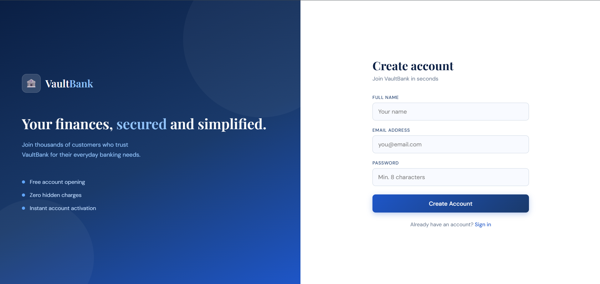
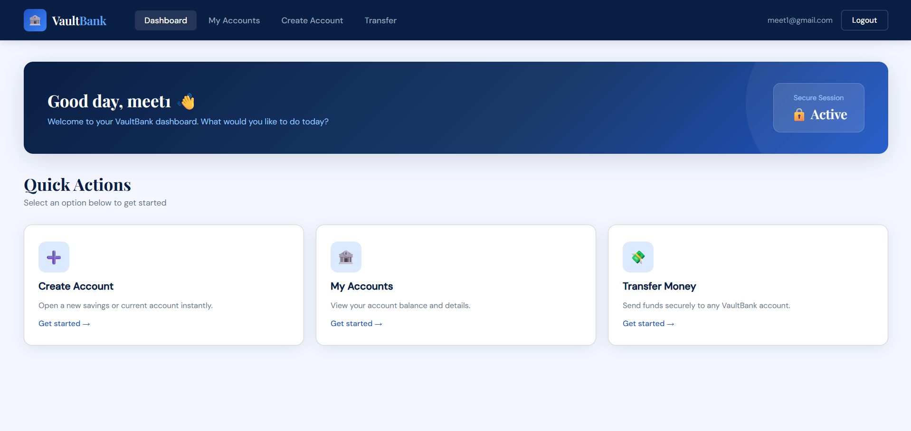
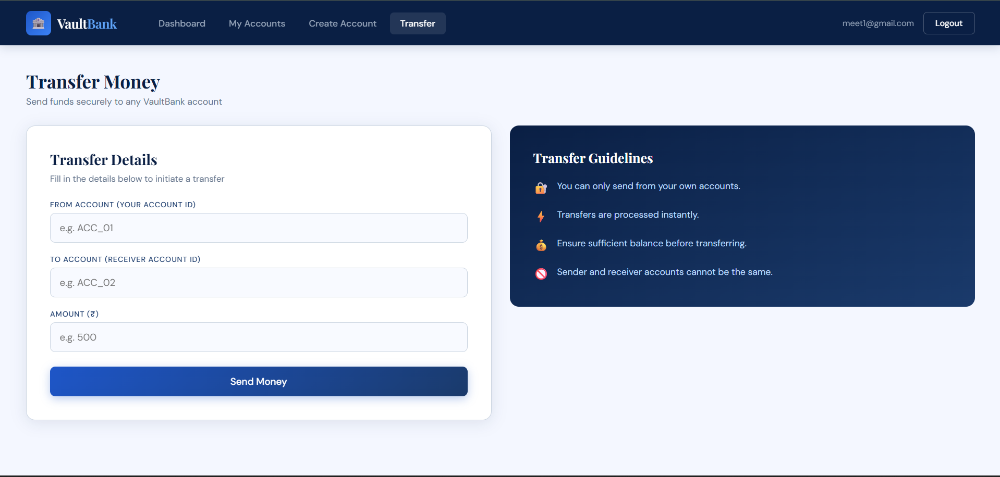
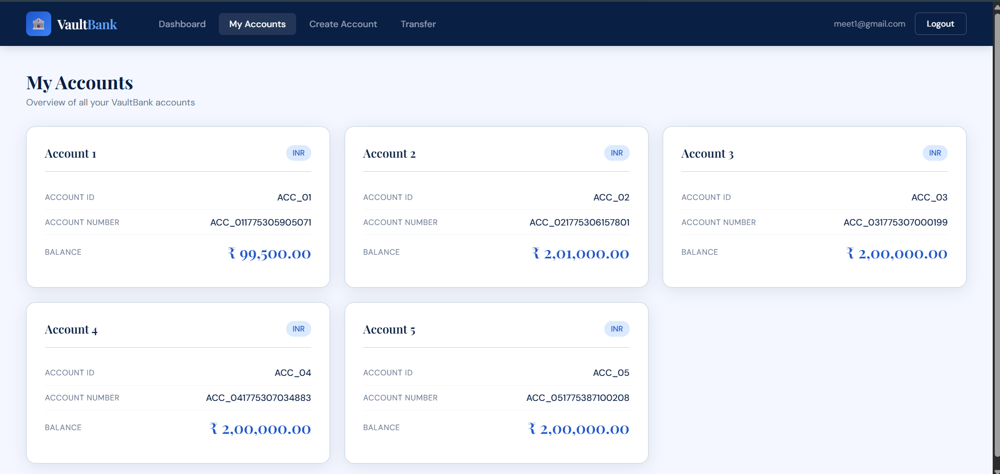

# Online Banking System (VaultBank)

## Overview
VaultBank is a full-stack online banking application built using Spring Boot and React. It enables users to securely register, authenticate, create bank accounts, view account details, and transfer money between accounts.


## Tech Stack

**Backend**
- Spring Boot (Java)
- Spring Security (JWT Authentication)
- Spring Data JPA

**Frontend**
- React (Vite)
- Axios

**Database**
- MySQL


## Project Description

This application simulates core banking functionalities such as account management and fund transfers. It is designed to demonstrate secure authentication, RESTful API design, and full-stack integration between frontend and backend systems.

## Important Notes

- The **account creation feature is implemented for practice/demo purposes only**.  
  In real-world banking systems, account creation requires a proper **deposit and verification process**, which is not included in this project.


## Features

- User Registration and Login with JWT Authentication
- Secure API endpoints with token-based authorization
- Create bank accounts
- View all accounts of the logged-in user
- Transfer money between accounts
- Transaction handling with consistency using `@Transactional`


## Backend Structure
com.bank
├── controller # REST Controllers (Auth, Account, Transfer)
├── services # Business Logic Layer
├── repository # JPA Repositories
├── entity # Database Entities
├── dto # Request/Response DTOs
├── security # JWT Filter and Security Config


## Frontend Structure
src
├── components # Reusable UI components
├── Pages # Application pages (Login, Register, Dashboard, etc.)
├── Services # API calls using Axios
├── App.jsx # Routing configuration


## How to Run

### 1. Backend Setup (Spring Boot)

```bash
# Clone the repository
git clone <https://github.com/prajapati-meet/Online_Banking_System.git>

# Navigate to backend folder
cd Online_Banking_System

# Build and run the application
mvn spring-boot:run
```

### 2. Database Configuration(Update application.properties)

```
spring.datasource.url=jdbc:mysql://localhost:3306/vaultbank
spring.datasource.username=YOUR_USERNAME
spring.datasource.password=YOUR_PASSWORD

spring.jpa.hibernate.ddl-auto=update
```

### 3.Frontend Setup (React)

```
# Navigate to frontend folder
cd Online_banking_frontend/OnlineBank

# Install dependencies
npm install

# Run the development server
npm run dev
 ```

### 4. Run Application

Backend: http://localhost:8080
Frontend: http://localhost:5173

## ScreenShots

### Login Page


### Register Page


### Dashboard page


### Transfer page


### Account Details Page


##  Author

Prajapati Meet Ketankumar
